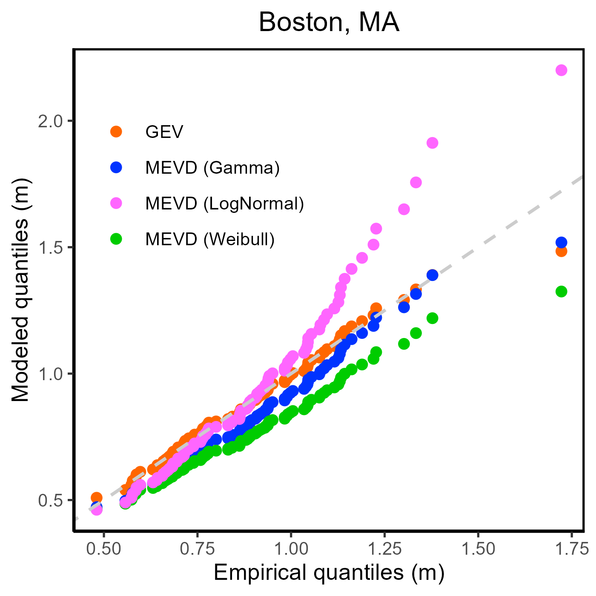

Boumis, G., Moftakhari, H. R., & Moradkhani, H. (2024). A metastatistical frequency analysis of extreme storm surge hazard along the US coastline. *Coastal Engineering Journal* [https://doi.org/10.1080/21664250.2024.2338323](https://doi.org/10.1080/21664250.2024.2338323)

  

## Summary
In this work, we have compared the widely used Generalized Extreme Value (GEV) distribution with the newly emerged Metastatistical Extreme Value Distribution (MEVD) for modeling extreme storm surge data of multiple tide gauges along the US coastline. Specifically, we have assessed the goodness-of-fit of both distributions by first fitting them to the entire observational record and then inspecting quantile-to-quantile plots. In addition, we have evaluated their ability to predict out-of-sample storm surge extremes by means of a cross-validation experiment; we iteratively divided the data record into a calibration set used for parameter estimation and a validation set used for calculation of the predictive error associated with the prediction of the most extreme "unobserved" event.

## Details
This repository hosts R scripts for 1) extracting "ordinary" surge events as defined in the research article (**extractOrdinary.R**), 2) estimating observed storm surge extremes with both the GEV distribution and the MEVD which can be used for plotting quantile-to-quantile plots (**estimateObserved.R**), and 3) conducting a cross-validation exercise to assess the capabilities of the two distributions when predicting "unseen" upper-tail quantiles of extreme storm surge (**predictUnobserved.R**). All sample scripts hosted here are based on data from a single tide gauge, i.e., Boston, MA. Additional scripts for plotting the results as shown in the research article are available upon request.
